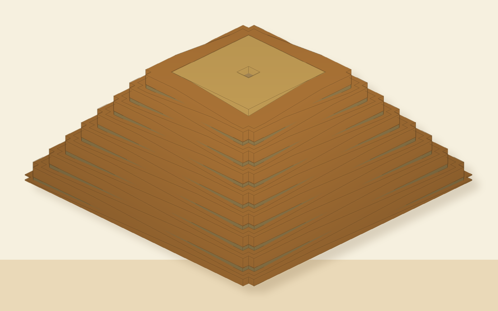
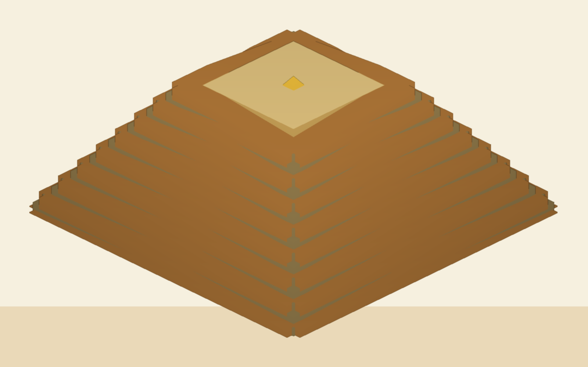
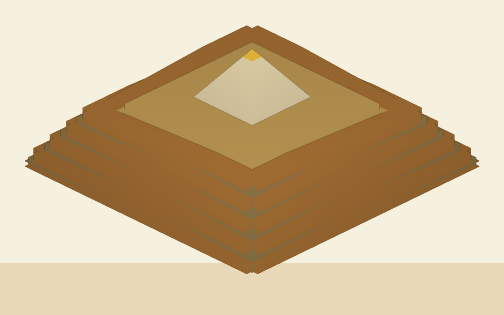
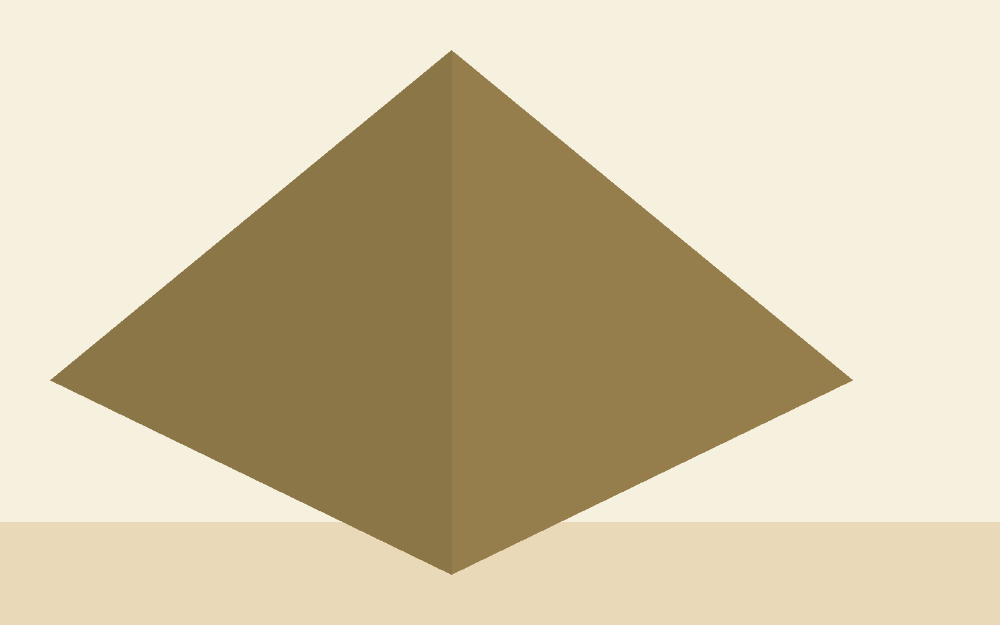

# Giza Pyramid Construction Theory STL Kit

This is a printable/viewable parametric model of one proposed construction sequence:

1. Cut the subterranean/lower chamber below grade.
2. Build an inner stepped mound/core and temporary fill from the ground up.
3. Use a single switchback ramp system on all four sides.
4. Use flat landings at each level, about one quarter of the incoming ramp run.
5. Leave an outer-corner notch in each landing for material savings and corner sight-line alignment.
6. Place the capstone on a flat, level top platform.
7. Remove ramp and fill material from the top downward.
8. Add and align outer casing stones as temporary material comes down.
9. Stage removed material as stock for another pyramid/foundation.

The files are a conceptual geometry model, not an archaeological claim. The defaults use a Giza-like slope ratio at tabletop scale: 160 mm square base and 101.8 mm height.

## Preview

<p>
  
  
  
  
</p>

## Quick Start

Live demo:

```text
https://danieliser.github.io/giza-pyramid-kit/demo/
```

Local demo:

```bash
make generate
make validate
make serve
```

Then open `http://localhost:8026/demo/`.

No Python package install is required; the generator uses only the Python standard library. The browser demo loads Three.js from a CDN.

## Repository Guide

- `generate_giza_kit.py` builds all STL outputs.
- `validate_geometry.py` checks core ramp/fill geometry assumptions.
- `demo/` contains the static animated viewer.
- `dist/` contains generated printable STLs, demo STLs, constructed states, and the manifest. It is intentionally included for GitHub downloads.
- `docs/PRINTING.md` has scale and printer notes, including Flashforge Adventurer 4 Pro guidance.
- `docs/PUBLISHING.md` has the GitHub and maker-site publishing checklist.
- `docs/BLOG_POST_DRAFT.md` is a ready-draft article for danieliser.com.
- `release/thingiverse/` contains maker-site listing copy, upload checklist, generated preview renders, and the upload bundle.

## Source Theory Notes

The closest match for the gold reference concept is Huni Choi's top-down, cannibalizing pyramid hypothesis, popularized by DamiLee's 2026 video. This is not the spiral or edge-integrated ramp theory. Choi's idea is that the builders first made an oversized trapezoidal stepped mass with integrated working ramps, placed a small capstone/pyramidion on a broad flat platform, then carved and dismantled downward into the finished pyramid. The removed stone becomes feedstock for the next pyramid and surrounding works.

Public source trail:

- Huni Choi's page: https://www.facebook.com/HuniChoiPyramid/
- DamiLee video: https://www.youtube.com/watch?v=h5kWDOuY2Uo
- r/egyptology discussion with concise theory restatements and critiques: https://www.reddit.com/r/egyptology/comments/1qukphc/opinions_on_huni_choi/
- EgyptToday note on Choi's book: https://www.egypttoday.com/Article/4/116959/Korean-researcher-publishes-book-on-miracle-of-Great-Pyramid-of
- OpenCulture summary: https://www.openculture.com/2026/02/were-the-egyptian-pyramids-not-built-up-but-carved-down.html
- Secondary written summary with the recycling numbers: https://wealthness42.substack.com/p/this-new-pyramid-theory-explains

Useful calibration targets from that source trail:

- Khufu finished mass: roughly 6 million tons.
- Proposed temporary overbuilt mass: roughly 8 million tons.
- Proposed reusable surplus: roughly 2 million tons feeding Khafre's pyramid and other Giza structures.
- Whole-plateau loop: roughly 14 million tons circulated, with about 1 million tons left over in one public summary.
- Ramp/work path: often described as a workable seven degree slope.

This kit is still a conceptual printable model. I have not found public STL/OBJ downloads of Choi's hand-modeled blocks; his primary public material appears to be posts, video/book explanations, diagrams, and rendered/model screenshots.

## Interior Reference Sources

The optional `internal_chambers_reference.stl` is a print-inflated schematic insert based on public Great Pyramid section drawings and published dimensions. It includes the descending passage, ascending passage, Queen's Chamber, Grand Gallery, King's Chamber, sarcophagus, stress-relieving chambers, and simplified shaft references. It is a first-pass alignment aid, not a survey-grade void model.

Useful public references:

- Wikimedia Commons S-N schematic: https://commons.wikimedia.org/wiki/File:Great_Pyramid_S-N_Diagram.svg
- Wikimedia Commons inner-structure rendering: https://commons.wikimedia.org/wiki/File:Cheops-Pyramid.svg
- Britannica overview of interior route: https://www.britannica.com/story/whats-inside-the-great-pyramid
- Smarthistory Khufu pyramid interior notes: https://smarthistory.org/pyramid-of-khufu/

## Generate the Files

```bash
python3 generate_giza_kit.py
```

Output goes to `dist/`:

- `dist/printable/` contains major printable/viewable parts. The grouped ramp files include local underfill only, not the whole stepped mound.
- `dist/printable/core_layers/` contains one printable inner mound layer per course.
- `dist/printable/fill_layers/` contains one printable temporary stepped-fill layer per course.
- `dist/printable/ramp_layers/` contains one printable ramp/landing/support layer per course.
- `dist/printable/chamber_layers/` contains one printable chamber/corridor reference slice per course.
- `dist/printable/ramp_segments/` contains per-face, per-level ramp and corner pieces for modular teardown.
- `dist/printable/internal_chambers_reference.stl` is a separate scaled insert/overlay for chamber planning.
- `dist/printable/internal_chambers_subterranean_precut.stl` is the below-grade chamber/passage portion shown before course 1.
- `dist/demo_parts/` contains assembly-coordinate parts for the animated browser demo.
- `dist/demo_layers/` contains assembly-coordinate fill and ramp layers for animation or inspection.
- `dist/view_stages/` contains assembled STL snapshots in world position.
- `dist/constructed_states/` contains one-piece combined state models.
- `dist/manifest.json` lists every generated file, triangle count, and bounds.

## Suggested Print Set

For a simple physical kit, print:

- `inner_stepped_core.stl`
- layer-by-layer inner mound alternatives from `core_layers/`
- `temporary_ramp_backfill.stl` for the cut stepped mound behind the ramp corridors
- `temporary_ramp_local_underfill.stl` for support filled down to the next lower course edge
- layer-by-layer alternatives from `fill_layers/` and `ramp_layers/`
- `capstone.stl`
- `temporary_flat_capstone_platform.stl`
- `internal_chambers_reference.stl` if you want the known chamber/corridor layout as a removable inspection insert
- `internal_chambers_subterranean_precut.stl` and `chamber_layers/` if you want the chambers to appear with each build course
- either local-underfilled side ramp files (`temporary_switchback_ramps_north/east/south/west.stl`) or modular ramp pieces from `ramp_segments/`
- `casing_ring_top_01.stl` through `casing_ring_top_16.stl`
- optional: `reuse_material_stockpile_for_next_pyramid.stl`
- optional: `next_pyramid_seed_foundation.stl`

The grouped side-ramp files are intended as printable side assemblies: each elevated ramp is filled locally down to the nearest lower course edge. The stepped mound behind the ramp corridors is cut away separately in `temporary_ramp_backfill.stl`, so opening a single side ramp no longer looks like a whole stepped pyramid. For a teardown kit, use the individual files in `printable/ramp_segments/`.

## Constructed States

Single-piece combined models are generated in `dist/constructed_states/`:

- `constructed_01_full_backfilled_ramp_system.stl`
- `constructed_02_capstone_set_before_deramping.stl`
- `constructed_03_partial_top_down_deramping.stl`
- `constructed_04_finished_pyramid.stl`

These are useful for inspecting or printing whole moments in the sequence without assembling individual parts.

## Assembly Storyboard

1. Place or expose `internal_chambers_subterranean_precut.stl` below the base plane.
2. Build `core_layers/`, `fill_layers/`, `chamber_layers/`, and `ramp_layers/` upward course by course.
3. Put the flat platform and capstone at the top.
4. Remove upper temporary pieces first.
5. Add `casing_ring_top_01.stl`, then `top_02`, and continue downward.
6. Finish with the inner mound/core, capstone, and all casing rings in place.
7. Move removed temporary material to the stockpile or next foundation piece.

## Parametric Tweaks

Examples:

```bash
python3 generate_giza_kit.py --base-mm 120 --courses 12 --casing-rings 12
python3 generate_giza_kit.py --base-mm 200 --height-mm 127.25 --ramp-width-mm 24
```

Useful flags:

- `--base-mm`: finished pyramid base width.
- `--height-mm`: finished pyramid height.
- `--courses`: number of stepped core courses and switchback levels.
- `--casing-rings`: number of removable outer casing rings.
- `--ramp-width-mm`: width of temporary ramp ribbons. The default is broad enough to read as a working construction path around the top deck.
- `--top-platform-half-fraction`: width of the broad temporary top work deck before the capstone is set.
- `--temporary-overbuild-mm`: uniform outward offset for the temporary overbuilt work mass. Leave at `0` to infer it from the top deck size and widen every level evenly.
- `--core-base-fraction`: how much of the final footprint is permanent inner core.
- `--capstone-height-mm`: pyramidion/capstone height. The default is intentionally small so it sits on a broad temporary top platform.

The generated STL units are millimeters.

## Printing

See `docs/PRINTING.md` for scale guidance. The short version: the finished 160 mm pyramid fits many desktop printers, but the full all-sides temporary ramp state is about 265 mm wide. On a Flashforge Adventurer 4 Pro, `75%` scale is the best all-around kit size, and `62.5%` is a good compact display size.

## Animated Demo

Generate the STLs, then serve the project root over HTTP:

```bash
python3 generate_giza_kit.py
python3 -m http.server 8026
```

Open `http://localhost:8026/demo/`. The demo loads `dist/demo_parts/` and animates the below-grade chamber precut, layer-built inner mound, chamber slices, cut stepped mound, local ramp underfill, switchback ramps, capstone, top-down casing, and a large animation-only reuse pile.

The current demo builds the temporary system course by course: each fill layer appears first, the matching single-switchback ramp and notched corner landing follows, then removal reverses from the top down before the casing appears in the cleared course.

During top-down removal, the browser demo grows the reuse pile immediately. Its growth is weighted by the loaded fill/ramp layer volumes, so small upper layers add less visible material than larger lower layers. This pile is intentionally animation-only; it does not add more print parts beyond the optional stockpile/foundation STLs.

## Geometry Check

Run this after changing ramp math:

```bash
python3 validate_geometry.py
```

It checks that single-switchback ramps, notched corner landings, cut mound, and local underfill have positive geometry with upward sloped walking faces.

## Maker-Site Release

Build the Thingiverse/Printables-style upload packet with:

```bash
make release
```

This creates preview renders, a curated upload folder, and `release/thingiverse/giza-pyramid-construction-theory-stl-kit-v0.1.0.zip`.

## License

No final open-source or model-sharing license has been selected yet. The maker-site release notes recommend Creative Commons Attribution-NonCommercial-ShareAlike 4.0 as a starting point, but the final license should be selected deliberately before publishing.
